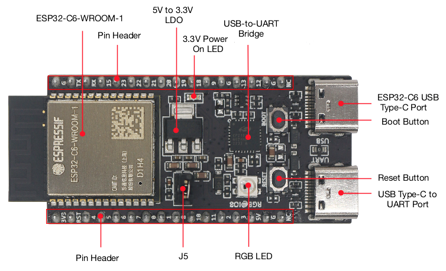

# esp-matter-workshop
ESP Matter Workshop for BSides Seattle 2023

## Get prepped before you come!

To ensure that you have the best experience on the day of the
workshop, you really want to install all the pre-reqs ahead of
time, as there's about 25G of stuff to install.

Please work your way though this README just up to flashing the
device, because you won't have the device yet. But please get
the tools and container below installed and make sure you can do
the `hello_world` build.

## Required Hardware

> **Warning**
> WE ARE NOT PROVIDING USB-C CABLES for FLASHING and POWERING
> THE ESP32-C6 DEV BOARDS.

Before you go any further, make sure you have two USB-C to whatever
your laptop uses (USB-A or USB-C, as appropriate) cables in your bag
for use on the day of the workshop.

## Optional Hardware

If you're feeling adventurous, feel free to bring a breadboard and a
couple of sensors you might have hanging around. There's a [3p library
of drivers](https://github.com/UncleRus/esp-idf-lib) for the ESP IDF
framework available. Check the docs to see if you might have something in
your parts bin that's supported.

https://esp-idf-lib.readthedocs.io/en/latest/index.html

The ESP32-C6 dev boards come with header pins already installed.

## Required software

You'll need some basic dev tools installed on your laptop

* [Git](https://git-scm.com/book/en/v2/Getting-Started-Installing-Git)
* [Docker](https://docs.docker.com/get-docker/)
* [esptool](https://github.com/espressif/esptool)
* a code editor. I'm using [VS Code](https://code.visualstudio.com/download), but you're free to use whatever

## Check out a copy of this workshop repo

```bash
git clone https://github.com/ducksauz/esp-matter-workshop.git
cd esp-matter-workshop
```

## Download the build container

Build containers are a great way to ensure that everyone is working
with the same tooling. They're especially helpful for this build
environment, as there are a lot of dependencies that are a real pain
in the butt to get installed properly. 

There's a [separate repo](https://github.com/ducksauz/esp-matter-dev)
for the build container config, and you're welcome to build it yourself
if you like, but you can also just grab the built container from dockerhub.

```bash
docker pull ducksauz/esp-matter-dev:latest
```

We'll run the build containers with `$PWD` mounted into the
container as `/workspaces`. This gives us a shared path accessible by
both the container and host OS.

```bash
docker run -it --mount type=bind,source="$(pwd)",target=/workspaces \
    ducksauz/esp-matter-dev:latest
```

You should get some output that looks like this and then a root shell
prompt within the container.

```bash
Adding ESP-IDF tools to PATH...
Checking if Python packages are up to date...
Constraint file: /opt/esp/tools/espidf.constraints.v5.1.txt
Requirement files:
 - /opt/esp/idf/tools/requirements/requirements.core.txt
Python being checked: /opt/esp/tools/python_env/idf5.1_py3.9_env/bin/python
Python requirements are satisfied.
Added the following directories to PATH:

  /opt/esp/idf/components/espcoredump
  /opt/esp/idf/components/partition_table
  /opt/esp/idf/components/app_update
  /opt/esp/tools/tools/xtensa-esp-elf-gdb/12.1_20221002/xtensa-esp-elf-gdb/bin
  /opt/esp/tools/tools/riscv32-esp-elf-gdb/12.1_20221002/riscv32-esp-elf-gdb/bin
  /opt/esp/tools/tools/xtensa-esp32-elf/esp-12.2.0_20230208/xtensa-esp32-elf/bin
  /opt/esp/tools/tools/xtensa-esp32s2-elf/esp-12.2.0_20230208/xtensa-esp32s2-elf/bin
  /opt/esp/tools/tools/xtensa-esp32s3-elf/esp-12.2.0_20230208/xtensa-esp32s3-elf/bin
  /opt/esp/tools/tools/riscv32-esp-elf/esp-12.2.0_20230208/riscv32-esp-elf/bin
  /opt/esp/tools/tools/esp32ulp-elf/2.35_20220830/esp32ulp-elf/bin
  /opt/esp/tools/tools/cmake/3.24.0/bin
  /opt/esp/tools/tools/openocd-esp32/v0.12.0-esp32-20230313/openocd-esp32/bin
  /opt/esp/tools/python_env/idf5.1_py3.9_env/bin
  /opt/esp/idf/tools
Done! You can now compile ESP-IDF projects.
Go to the project directory and run:

  idf.py build

root@0d18872db56b:/#
```

## Basic build methodology

Now you're working within a shell inside the container. All the required 
SDKs (ESP IDF, Matter, Thread, and all their dependencies) are installed 
in the container and paths are set for you to just get to work. Let's build
the hello_world example to make sure that basic tooling is working properly.

```bash
cd /workspaces/examples/hello_world
```

Configure for the target board. We've got support for all the various esp32
targets in the container, but we're just working with esp32c6 today.

```bash
idf.py set-target esp32c6
```

Check out the menuconfig! I haven't had to custom compile a linux kernel
in ages, but this is just like that was the last time I did it. You shouldn't
have to change anything for the hello_world build, but you'll definitely
learn some options here. Especially with flash partitioning and component
enablement. For example, if you were building a low power Matter device 
with the esp32c6, you could make a device that just uses the BLE and Thread
support and skip building in wifi at all to save a lot of code space and power.

When you're done poking around the menuconfig, quit without saving and run 
the build.

```bash
idf.py menuconfig
idf.py build
```

After five or so minutes and close to a thousand build commands, the build
will be done and the tail of your build output will look something like this.

```bash
-- Build files have been written to: /workspaces/examples/hello_world/build/bootloader
[103/104] Generating binary image from built executableesptool.py v4.5.1
Creating esp32c6 image...
Merged 1 ELF section
Successfully created esp32c6 image.
Generated /workspaces/examples/hello_world/build/bootloader/bootloader.bin
[104/104] cd /workspaces/examples/hello_world/build/bootloader/esp-idf/es...ader 0x0 /workspaces/examples/hello_world/build/bootloader/bootloader.binBootloader binary size 0x50b0 bytes. 0x2f50 bytes (37%) free.
[890/891] Generating binary image from built executableesptool.py v4.5.1
Creating esp32c6 image...
Merged 1 ELF section
Successfully created esp32c6 image.
Generated /workspaces/examples/hello_world/build/hello_world.bin
[891/891] cd /workspaces/examples/hello_world/build/esp-idf/esptool_py &&...artition-table.bin /workspaces/examples/hello_world/build/hello_world.binhello_world.bin binary size 0x1e500 bytes. Smallest app partition is 0x100000 bytes. 0xe1b00 bytes (88%) free.

Project build complete. To flash, run this command:
/opt/esp/tools/python_env/idf5.1_py3.9_env/bin/python ../../opt/esp/idf/components/esptool_py/esptool/esptool.py -p (PORT) -b 460800 --before default_reset --after hard_reset --chip esp32c6  write_flash --flash_mode dio --flash_size 2MB --flash_freq 80m 0x0 build/bootloader/bootloader.bin 0x8000 build/partition_table/partition-table.bin 0x10000 build/hello_world.bin
or run 'idf.py -p (PORT) flash'
root@b6f14b7080a6:/workspaces/examples/hello_world#
```

## Flashing the dev board

Connect one of your dev boards to your laptop via the USB-C to UART port,
which is the port in the bottom right of the diagram below. With the component
side up and the USB-C ports pointing down, it is the port on the left.



The device port should be something like the following depending on your OS:

* Linux: `/dev/tty-usbserialXXXX`
* macOS: `/dev/tty.usbserial-220`
* Windows: `COM5` (need a windows person in the workshop to help here)

Now we need to go back to a shell in your host OS to flash the dev board,

```bash
cd path/to/esp-matter-workshop
cd examples/hello_world
```

At the end of the build output above, you got a very long `esptool.py` command line.
You'll call esptool however you installed it in your host OS (whether it is a standalone
executable or a python script) and then copy everything after the port parameter. I've
added lines for readability below, but you can just copy/pasta everything from `-b` onward.

```bash
esptool --port /dev/tty.usbserial-220 \
    -b 460800 --before default_reset --after hard_reset \
    --chip esp32c6  write_flash --flash_mode dio --flash_size 2MB \
    --flash_freq 80m \ 
    0x0 build/bootloader/bootloader.bin \
    0x8000 build/partition_table/partition-table.bin \
    0x10000 build/hello_world.bin
```


