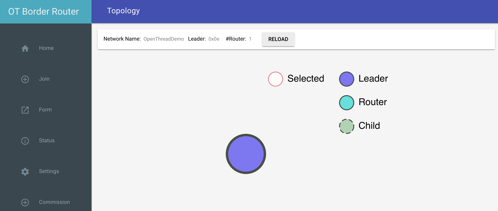

# Running OTBR over Tailscale Funnel

I wanted to have an Open Thread Border Router instance running for the
workshop, but I didn't want to have to worry about whether the conference
wifi allowed wireless peers to communicate to each other. Conveniently,
Tailscale recently released their 
[funnel feature](https://tailscale.com/kb/1223/tailscale-funnel/) that
lets you expose a service on your tailnet to the greater internet. They
even make it easy to get a cert for it as well.

This is very cool and handy, but did require some system config and a minor
change to the OTBR webUI.

## The problem

The OTBR webUI is a single page app served by the `otbr-web` service on
port 8080. It has javascript components that talk to the `otbr-agent`
service that exposes a RESTful service on port 8081. Just exposing `otbr-web`
via Funnel leaves you unable to do anything because you can't get to the
`otbr-agent` REST endpoints, so we've got to fix that.

## Funnel Setup

First let's get a cert and enable funnel. I logged into my Tailscale
dashboard and cycled through the randomly generated ts.net subdomains
until I got one that I liked. Then back on the pi, I ran this command
to request a Let's Encrypt certificate.

```bash
tailscale cert touchpi.banded-decibel.ts.net
```

Now we need to enable funnel and setup the endpoints to serve. If you've
used a cloud load balancer before, the path config here is going to feel
very familiar.

```bash
tailscale funnel 443 on

# This serves the otbr webUI
tailscale serve https / http://127.0.0.1:8080

# These serve the otbr agent RESTful service (trailing slashes matter)
tailscale serve https /node/ http://127.0.0.1:8081/node/
tailscale serve https /diagnostics/ http://127.0.0.1:8081/diagnostics/
```

Then you can check the status

```bash
$ tailscale funnel status

# Funnel on:
#     - https://touchpi.banded-decibel.ts.net

https://touchpi.banded-decibel.ts.net (Funnel on)
|-- /             proxy http://127.0.0.1:8080
|-- /node/        proxy http://127.0.0.1:8081/node/
|-- /diagnostics/ proxy http://127.0.0.1:8081/diagnostics/
```

So, that's great, but the javascript in the webUI is still pointing at
port 8081 for the otbr-agent endpoints. Let's fix that with a quick change
to `app.js` in `ot-br-posix`. We're just changing the `restServerPort` value
and changing protocol to `https`

```bash
$ git diff -U1 src/web/web-service/frontend/res/js/app.js
diff --git a/src/web/web-service/frontend/res/js/app.js b/src/web/web-service/frontend/res/js/app.js
index 8705200746..4bc9c7c253 100644
--- a/src/web/web-service/frontend/res/js/app.js
+++ b/src/web/web-service/frontend/res/js/app.js
@@ -434,3 +434,3 @@

-        $scope.restServerPort = '8081';
+        $scope.restServerPort = '443';
         $scope.ipAddr = window.location.hostname + ':' + $scope.restServerPort;
@@ -470,3 +470,3 @@

-            $http.get('http://' + $scope.ipAddr + '/node').then(function(response) {
+            $http.get('https://' + $scope.ipAddr + '/node').then(function(response) {

@@ -507,3 +507,3 @@
             };
-            $http.get('http://' + $scope.ipAddr + '/diagnostics').then(function(response) {
+            $http.get('https://' + $scope.ipAddr + '/diagnostics').then(function(response) {
```

Now we have to re-run the setup script to rebuild and re-install otbr-web.

```bash
# Rerun the setup script
INFRA_IF_NAME=wlan0 WEB_GUI=1 ./script/setup

# Restart both OTBR processes for good measure
sudo systemctl restart otbr-agent
sudo systemctl restart otbr-web
```

And now, like magic, the parts that interact with `otbr-agent` are working.


